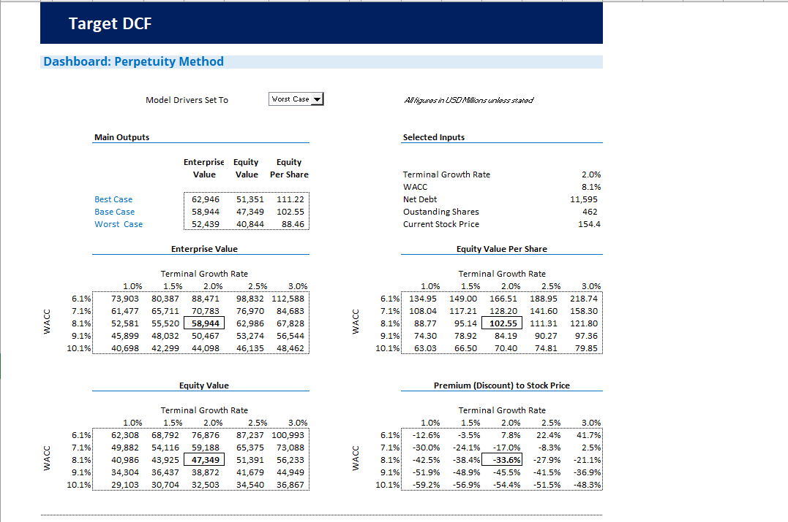
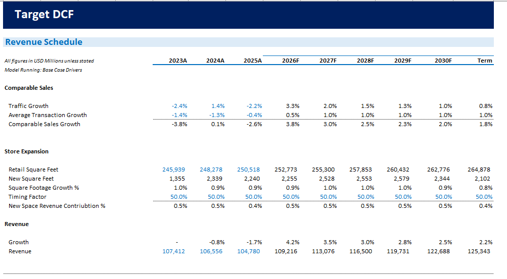
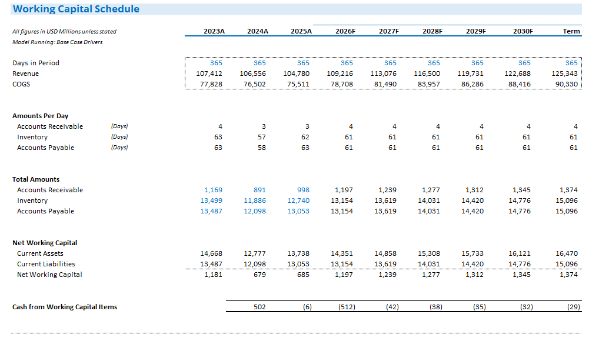
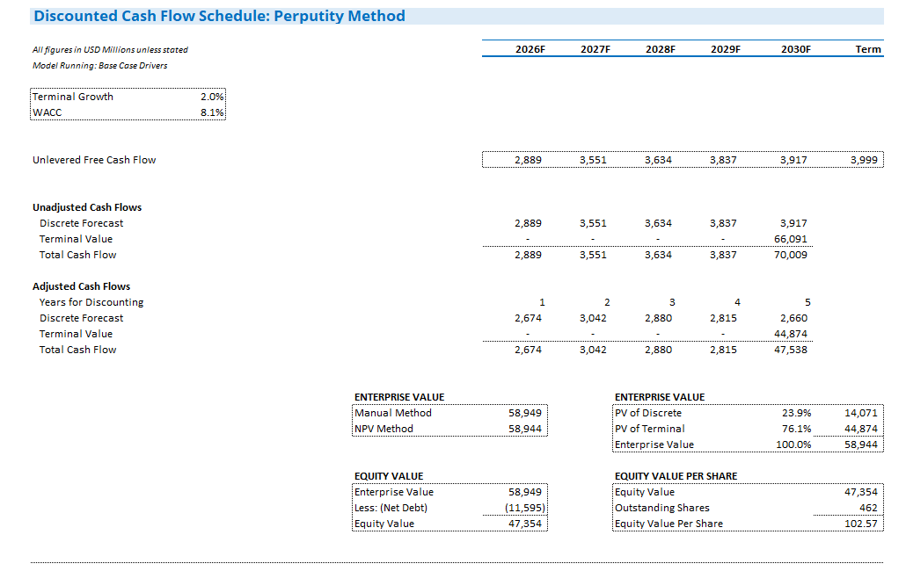

# Target Corporation DCF Valuation Model
An Excel-based discounted cash flow model for Target Corporation (NYSE: TGT), built to estimate intrinsic value using operating-driven forecasts and multiple terminal value methodologies.

## Overview

The model forecasts Target's operating performance from 2026 through 2030 using company-specific revenue drivers rather than a simple top-line growth assumption.

Revenue is modeled using:
- Comparable store traffic growth
- Average transaction growth
- Retail square footage expansion
- New-store contribution

The resulting operating forecast flows through working capital, capital expenditures, depreciation, and ultimately unlevered free cash flow.

## Model Features 

- Best, Base, and Worst operating scenarios
- Comparable sales revenue build
- Store expansion schedule
- Income statement forecast
- Working capital schedule
- PP&E and depreciation schedule
- Unlevered free cash flow forecast
- CAPM-based cost of equity
- WACC calculation
- Perpetuity growth DCF
- Exit EV/EBITDA multiple DCF
- WACC / terminal assumption sensitivity analysis

 

## Valuation Dashboard

The valuation dashboard summarizes Best, Base, and Worst case outcomes while showing how enterprise value, equity value, and implied share price respond to changes in WACC and terminal growth assumptions.

## Revenue Schedule 

Revenue is forecast using Target-specific operating drivers, with comparable sales derived from traffic and average transaction growth. New-space revenue contribution incorporates retail square footage expansion and a partial-year timing factor.

## Working Capital Schedule 

Working capital is forecast using historical accounts receivable, inventory, and accounts payable days, with changes in net working capital flowing directly into unlevered free cash flow.

## DCF: Perpetuity Method

The perpetuity growth DCF discounts forecast unlevered free cash flows using WACC and calculates terminal value using the Gordon Growth Model. Enterprise value is then bridged to equity value by adjusting for net debt.

 

## Valuation Methodology

Target is valued using two DCF terminal value methodologies:

- Perpetuity Growth Method
- Exit EV/EBITDA Multiple Method

Both approaches discount forecast unlevered free cash flow using a calculated WACC and bridge enterprise value to equity value using net debt.

## Data Sources

- Target Corporation annual reports and SEC filings
- Target Investor Relations
- Public market data for beta and market capitalization
- Public bond market data for cost of debt

## Disclaimer

This project was created for educational and portfolio purposes only and does not constitute investment advice.
